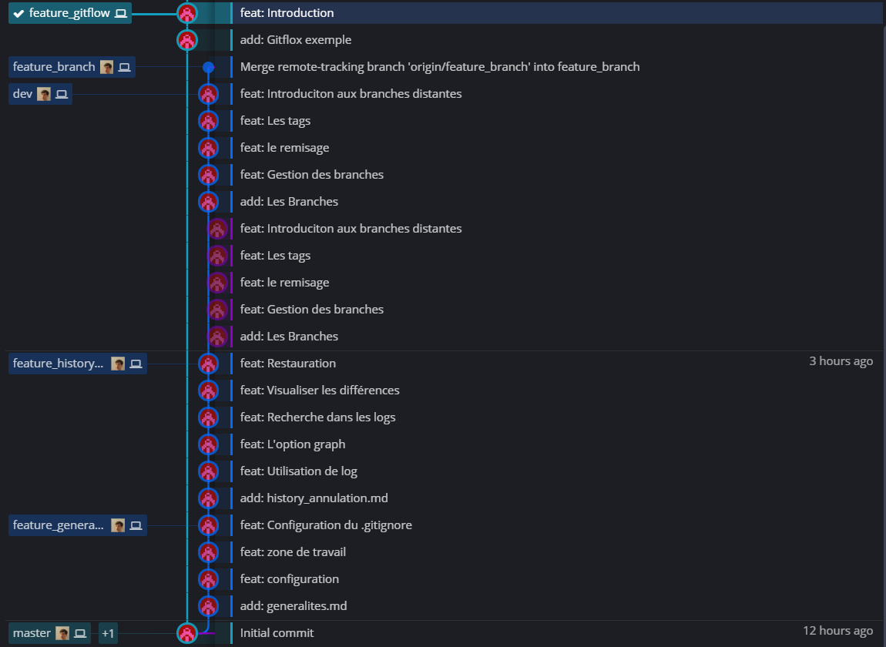

# GitFlow exemple
## Introduction
Pour utiliser Gitflow il faut deux branches permanentes: master et dev  
Les branches feature, release et hotfixe sont dites éphémères (on les supprimera)  
Les branches hotfixe et release sont mergées dans la branche master et dev  
La branche feature est mergée uniquement dans la branche dev  
Les hotfixes sont taguées avec le deuxième chiffre Y de version X.Y, exemple tag 0.2  
Les releases sont taguées avec le premier chiffre X de version X.Y, exemple tag 1.0  
Si on a une release et que l’on fait une nouvelle feature => merge dans dev et feature 
 
## Exemple
